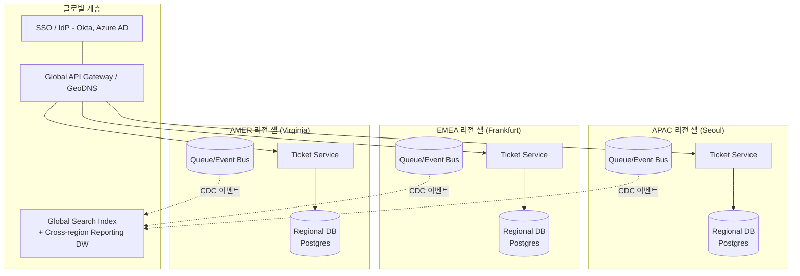
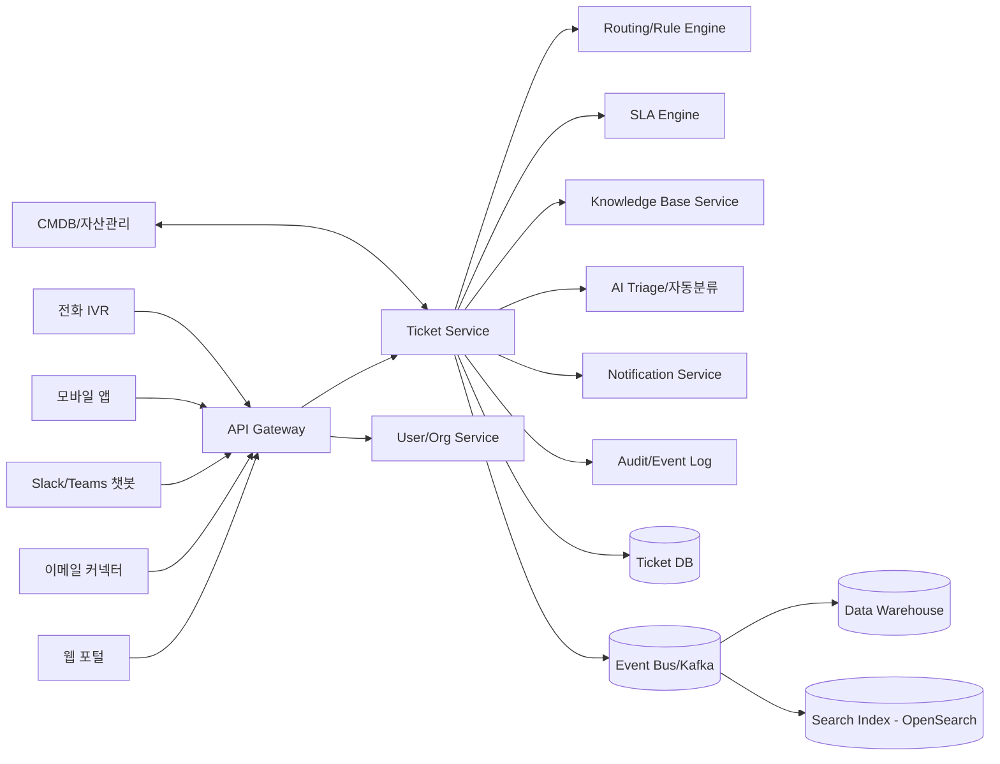
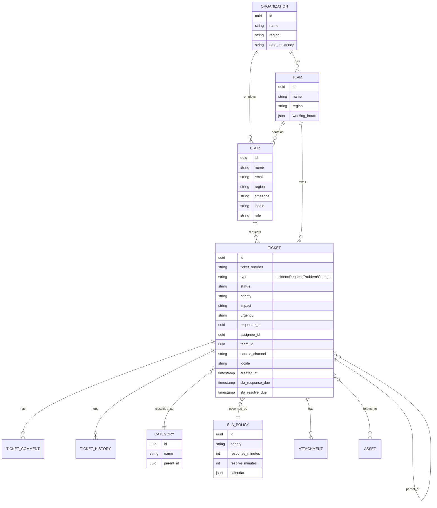
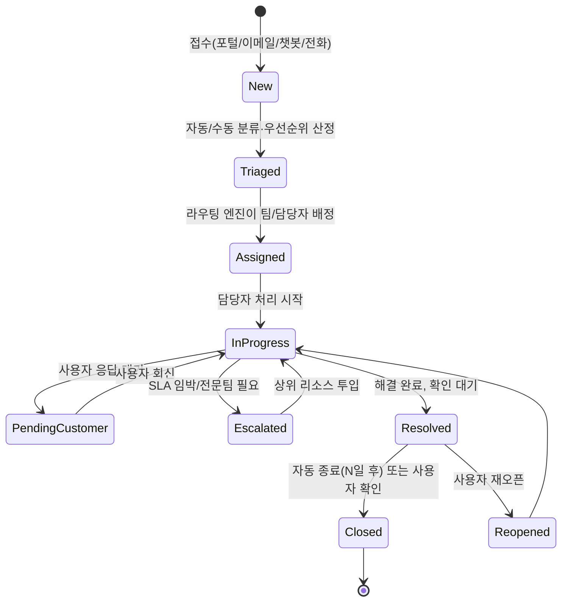
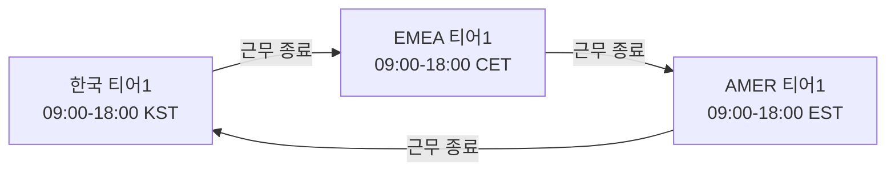

# 글로벌 IT 헬프데스크 티켓 시스템 설계

> 여러 국가/리전에 분산된 임직원을 지원하는 IT 헬프데스크를 위한 글로벌 티켓 시스템 설계 문서입니다.

## 1. 목표 및 범위

### 1.1 목표
- 전 세계 지사/리전의 임직원이 동일한 품질의 IT 지원을 받을 수 있는 단일 티켓 시스템 제공
- 리전별 근무시간(타임존)을 넘나드는 **Follow-the-Sun** 지원 체계 구현
- 다국어(한국어/영어/일본어 등) 접수 및 처리 지원
- SLA 기반 우선순위 관리와 자동 에스컬레이션
- 반복 문의의 자동화·셀프서비스(AI 트리아지, 지식베이스, 챗봇) 처리로 상담원 부하 감소
- 데이터 레지던시(개인정보 보호 규제) 준수: GDPR(EU), PIPA(한국) 등 리전별 법규 대응

### 1.2 비목표(Out of Scope)
- 고객 대상 CS 티켓팅(본 시스템은 사내 IT 헬프데스크 전용)
- 자산관리(ITAM), CMDB 전체 기능 — 연동은 하되 자체 구축하지 않음

## 2. 요구사항

### 2.1 기능 요구사항
| 구분 | 요구사항 |
|---|---|
| 접수 채널 | 웹 포털, 이메일, Slack/Teams 챗봇, 전화(IVR 연동), 모바일 앱, API |
| 티켓 분류 | 카테고리/서브카테고리, 우선순위, 영향도(Impact) × 긴급도(Urgency) 매트릭스 |
| 라우팅 | 리전/스킬/부서 기반 자동 배정, 라운드로빈·부하 기반 배정 |
| SLA 관리 | 우선순위별 응답/해결 목표시간, 근무시간 캘린더 기반 SLA 타이머, 자동 에스컬레이션 |
| 협업 | 내부 노트, 다른 팀에 전달(Transfer), 상위 티켓-하위 태스크(부모/자식) |
| 지식베이스 | KB 문서 추천(검색/유사도), 셀프서비스 포털 |
| 자동화 | 규칙 엔진(트리거→조건→액션), AI 기반 자동 분류/자동 답변 제안 |
| 자산 연동 | CMDB/자산관리 시스템과 연동, 티켓에 자산 태깅 |
| 변경 연동 | 인시던트→문제(Problem)→변경(Change) 프로세스와 연계 (ITIL 정렬) |
| 알림 | 이메일/Slack/Teams/모바일 푸시, 사용자 알림 설정 |
| 리포팅 | SLA 준수율, 처리시간, 만족도(CSAT), 리전별/카테고리별 대시보드 |
| 감사 | 모든 상태 변경 이력(Audit Trail), 접근 로그 |

### 2.2 비기능 요구사항
- **가용성**: 99.9% 이상, 리전 장애 시에도 타 리전에서 서비스 지속(액티브-액티브)
- **지연시간**: 사용자 소재 리전에서 P95 API 응답 300ms 이내
- **확장성**: 글로벌 동시 사용자 수만~십만 명, 초당 수백 건 티켓 생성 대응
- **데이터 레지던시**: EU 사용자 데이터는 EU 리전에 저장(GDPR), 필요 시 리전별 데이터 분리
- **보안**: SSO(SAML/OIDC), RBAC, 저장/전송 데이터 암호화, 감사로그 불변성
- **다국어**: UI/알림/KB 다국어 지원, 티켓 본문 자동 번역(선택적)
- **재해복구**: RPO ≤ 15분, RTO ≤ 1시간

## 3. 전체 아키텍처

### 3.1 멀티 리전 배치 전략
글로벌 헬프데스크는 지연시간과 데이터 레지던시 요구를 동시에 만족해야 하므로, **리전 셀(Cell) 기반 아키텍처**를 채택합니다.

- **리전 셀**: 사용자는 소속 리전(예: APAC/EMEA/AMER)의 셀에 데이터가 저장되며, 해당 셀에서 티켓 생성·조회·처리가 이루어짐 → 지연시간·규제 요구 동시 충족
- **글로벌 게이트웨이**: GeoDNS/Anycast로 사용자를 가장 가까운 리전으로 라우팅, SSO는 전역 공유
- **Follow-the-Sun 라우팅**: 특정 리전 근무시간 외 티켓은 라우팅 규칙에 따라 다음 근무 리전(또는 24x7 글로벌 티어1 팀)으로 자동 이관
- **글로벌 리포팅**: 각 리전 DB의 변경 이벤트(CDC)를 이벤트 버스로 발행 → 중앙 데이터 웨어하우스에 적재해 전사 대시보드 제공(개인정보는 마스킹/집계)

### 3.2 논리적 컴포넌트

## 4. 핵심 도메인 모델

### 4.1 엔터티 개요

### 4.2 티켓 유형 (ITIL 정렬)
- **Incident(장애)**: 정상 서비스의 예기치 않은 중단/저하
- **Service Request(서비스 요청)**: 계정 발급, 소프트웨어 설치 등 표준 요청
- **Problem(문제)**: 반복 인시던트의 근본 원인 분석 티켓
- **Change(변경)**: 시스템/인프라 변경 요청 (승인 워크플로우 포함)

### 4.3 우선순위 매트릭스 (Impact × Urgency)
| 영향도 \ 긴급도 | 높음 | 보통 | 낮음 |
|---|---|---|---|
| **높음**(다수/전사 영향) | P1 - Critical | P2 - High | P3 - Medium |
| **보통**(팀/부서 영향) | P2 - High | P3 - Medium | P4 - Low |
| **낮음**(개인 영향) | P3 - Medium | P4 - Low | P4 - Low |

## 5. 티켓 라이프사이클

- **SLA 타이머**: `PendingCustomer` 상태에서는 SLA 시계가 일시정지(클록 스톱)됨
- **자동 종료**: `Resolved` 후 N영업일(예: 3일) 내 사용자 응답이 없으면 자동 `Closed`
- **재오픈 정책**: `Closed` 후 7일 이내 재문의는 기존 티켓 재오픈, 이후는 신규 티켓 + 연결(Link)

## 6. SLA 및 Follow-the-Sun 운영

### 6.1 SLA 정책 예시
| 우선순위 | 최초 응답 목표 | 해결 목표 | 비고 |
|---|---|---|---|
| P1 Critical | 15분 | 4시간 | 24x7, 즉시 온콜 호출 |
| P2 High | 30분 | 8업무시간 | 근무시간 기준 |
| P3 Medium | 4업무시간 | 2업무일 | 근무시간 기준 |
| P4 Low | 1업무일 | 5업무일 | 근무시간 기준 |

- SLA는 팀별 **근무시간 캘린더**(리전 공휴일 포함)를 기준으로 계산
- SLA 위반 임박(예: 80% 경과) 시 담당자에게 알림, 100% 경과 시 매니저에게 에스컬레이션

### 6.2 Follow-the-Sun 라우팅

- P1/P2 티켓은 근무 종료 시각에 다음 근무 리전 팀으로 자동 핸드오프(인계 노트 자동 생성)
- P3/P4는 원 소속 리전 팀 큐에 유지, 다음 근무일 처리
- 리전 간 핸드오프 시 언어 태그(요청자 로케일)를 유지하여 번역/컨텍스트 손실 방지

## 7. 다국어·다지역 지원

- **로케일**: 티켓 생성 시 요청자 브라우저/프로필 로케일 저장, UI·알림 메일 템플릿은 로케일별 다국어 리소스로 렌더링
- **번역**: 상담원과 요청자의 언어가 다를 경우 티켓 본문/댓글에 "원문 보기/번역 보기" 토글 제공(MT 엔진 연동, 결과는 참고용으로 명시)
- **지식베이스 현지화**: KB 문서는 언어별 버전 관리, 미번역 문서는 원문 + 자동번역 배지 표시
- **데이터 레지던시**: 조직 설정에서 리전별 데이터 저장 위치 지정, EU 직원 데이터는 EU 셀에만 저장, 크로스 리전 조회는 마스킹된 집계 데이터만 허용

## 8. 채널 통합

| 채널 | 처리 방식 |
|---|---|
| 웹 포털 | SSO 로그인 후 셀프서비스 신청 폼, 실시간 상태 추적 |
| 이메일 | 전용 수신 주소(helpdesk@…) → 이메일 파싱 후 티켓 자동 생성, 회신은 댓글로 스레딩 |
| Slack/Teams | 슬래시 커맨드/봇 DM으로 티켓 생성, 상태 변경 시 스레드에 알림 |
| 전화(IVR) | IVR에서 문의 접수 → 콜 트랜스크립트 첨부한 티켓 자동 생성 |
| API | 타 사내 시스템(사원포털, 온보딩 툴 등)에서 프로그래매틱 생성 |

## 9. 라우팅·자동화

- **규칙 엔진**: `IF 카테고리=계정잠금 AND 리전=APAC THEN 배정팀=APAC-IdM팀, 우선순위=P3` 형태의 트리거-조건-액션 규칙
- **부하 기반 배정**: 팀 내 담당자 현재 처리 건수를 고려해 자동 배정(라운드로빈 대비 편차 감소)
- **AI 트리아지**: 제목/본문을 분류 모델에 입력해 카테고리·우선순위 추천(상담원 최종 확인), 유사 KB 문서/과거 유사 티켓 추천으로 초기 응답 시간 단축
- **매크로/캔드 리스폰스**: 자주 쓰는 답변 템플릿으로 반복 작업 감소

## 10. 기술 스택 제안

| 레이어 | 제안 |
|---|---|
| 프런트엔드 | React + TypeScript, 다국어 i18n(react-intl), 반응형 웹/PWA |
| API 게이트웨이 | 리전별 배포 + GeoDNS(Route53/Cloudflare), OIDC 인증 |
| 백엔드 서비스 | 도메인별 마이크로서비스(Ticket, User/Org, Routing, SLA, Notification, KB) — REST/GraphQL + 이벤트 기반 비동기 처리 |
| 메시징 | Kafka/Kinesis — 서비스 간 이벤트, 리전 간 CDC 스트리밍 |
| 데이터베이스 | 리전별 PostgreSQL(운영 데이터), Redis(캐시/세션), OpenSearch(전문검색) |
| 데이터 웨어하우스 | 리전 데이터 → 중앙 DW(Snowflake/BigQuery)로 집계 리포팅 |
| 인증 | SAML/OIDC 연동 (Okta/Azure AD), SCIM 기반 사용자 프로비저닝 |
| 인프라 | Kubernetes 멀티 리전 클러스터, IaC(Terraform), 리전별 오토스케일링 |
| 관측성 | OpenTelemetry, 중앙 로그/메트릭(Datadog/Grafana), 리전별 알림 |

## 11. 보안·컴플라이언스

- SSO + MFA 필수, RBAC(요청자/상담원/팀리드/관리자/감사자)
- 저장 데이터 암호화(AES-256), 전송 구간 TLS 1.2+
- 개인정보 필드(전화번호, 사번 등) 컬럼 단위 암호화 및 마스킹 뷰
- 리전별 컴플라이언스: GDPR(EU), CCPA(미국), PIPA(한국) — 데이터 주체 열람/삭제 요청(SAR) 처리 절차 내장
- 전체 상태변경/열람 이력 불변 감사로그(WORM 스토리지), 최소 1년 보관
- 정기 접근권한 검토(Quarterly Access Review)

## 12. 리포팅·KPI

| 지표 | 설명 |
|---|---|
| SLA 준수율 | (SLA 내 해결 티켓 수 / 전체 해결 티켓 수) × 100, 리전·우선순위별 분해 |
| 평균 최초응답시간(FRT) | 접수~최초 응답까지 평균 시간 |
| 평균 해결시간(MTTR) | 접수~해결까지 평균 시간 |
| CSAT | 티켓 종료 후 만족도 설문 점수 |
| 재오픈율 | 종료 후 재오픈된 티켓 비율 |
| 셀프서비스 전환율 | KB/챗봇으로 상담원 개입 없이 해결된 비율 |
| 티어1 처리율(FCR) | 1차 상담원 선에서 해결된 비율(에스컬레이션 없음) |

## 13. 단계별 구현 로드맵

| 단계 | 기간(예) | 범위 |
|---|---|---|
| Phase 1 – MVP | 1~2개월 | 단일 리전, 티켓 CRUD, 기본 SLA, 웹 포털/이메일 채널, SSO |
| Phase 2 – 자동화 | +2개월 | 규칙 엔진, KB 연동, Slack/Teams 챗봇, 알림 시스템 |
| Phase 3 – 글로벌 확장 | +2~3개월 | 2번째/3번째 리전 셀 추가, Follow-the-Sun 라우팅, 다국어 UI/번역 |
| Phase 4 – 지능화 | +2개월 | AI 트리아지/추천, CSAT 분석, 예측 스태핑(피크 예측) |
| Phase 5 – 컴플라이언스 고도화 | 지속 | 리전별 데이터 레지던시 강화, SAR 자동화, 감사 대응 체계 |

## 14. 리스크 및 고려사항

- **리전 간 데이터 정합성**: 리전 셀 분리로 인해 글로벌 검색/리포팅이 최종 일관성(eventual consistency)을 가짐 — 실시간성이 필요한 화면은 리전 로컬 데이터만 사용
- **핸드오프 품질**: Follow-the-Sun 인계 시 컨텍스트 손실 방지를 위해 인수인계 노트 필수화, 인계 전 SLA 임박 티켓은 우선 처리
- **번역 신뢰도**: 기계번역 결과에 의존한 오진단 방지를 위해 원문 병기 및 "번역됨" 명시
- **조직 변경 대응**: 팀 구조/근무시간 캘린더 변경이 잦으므로 관리자 콘솔에서 셀프 서비스로 설정 가능해야 함
